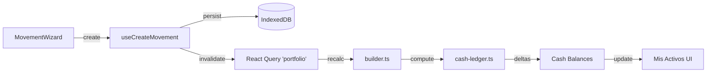

# Auditoría de Sistema de Movimientos (Egreso y Transferencia)
Fecha: 2026-02-07
Autor: Antigravity

## Resumen Ejecutivo
- **Estado Actual:** El sistema soporta "Ingreso" (DEPOSIT) y "Egreso" (WITHDRAW) para Billeteras, pero la UI de Egreso es básica y no valida saldo.
- **Transferencias:** No existe UI para Transferencias. El motor de balances (`cash-ledger.ts`) YA soporta los tipos `TRANSFER_IN` y `TRANSFER_OUT`, por lo que la implementación es puramente de UI y orquestación.
- **Validación:** La lógica de "Saldo Disponible" (`availableQty`) existe pero solo se aplica a Ventas (SELL) y Rescates (REDEEM), no a Egresos (WITHDRAW).
- **Riesgo:** Bajo. El motor de portfolio es robusto y ya maneja los tipos necesarios. El desafío es solo UX/UI en el Wizard.

## Snapshot & Baseline
- **Commit:** `git rev-parse --short HEAD` (ver output comando)
- **Tech Stack:** Vite + React + TypeScript + Tailwind.
- **Scripts:** `dev`, `build`, `lint`, `test`, `generate:cedears`.
- **Docs:** `docs/AI_HANDOFF.md` actualizado.

## Mapa del Flujo Actual

### UI Entry Point
- **Página Principal:** `src/pages/movements/MovementsPageV2.tsx` (Ruta: `/movements`)
- **Modal Principal:** `src/pages/movements/components/MovementWizard.tsx` (Componente monstruo que maneja todo)
- **Estado:** `WizardState` local controla `assetClass`, `opType`, `qty`, `accountId`.

### Logic Flow
1. **User Action:** Click "Nuevo Movimiento" -> `setIsWizardOpen(true)`.
2. **Step 1:** Selección de `AssetClass` (`cedear`, `crypto`, `wallet`, `pf`, etc.).
3. **Step 2:** Selección de `OpType` (Compra/Venta, Ingreso/Egreso).
    - Para `wallet`: Botones "Ingreso" (`opType='deposit'`) y "Egreso" (`opType='withdraw'`).
4. **Step 3:** Inputs de datos (Banco, Cantidad, Fecha).
5. **Confirm:** `handleConfirm` mapea `WizardState` a `Movement` object.
    - `deposit` -> `DEPOSIT`
    - `withdraw` -> `WITHDRAW`
6. **Persistencia:** `useCreateMovement` -> `movementsRepo.create` (IndexedDB/Backend).
7. **Impacto:** Invalida query `['portfolio']` -> Re-ejecuta `usePortfolioV2` -> `builder.ts` -> `cash-ledger.ts`.

### Diagrama de Impacto

## Modelo de Datos

### Tipos (`src/domain/types.ts`)
- **MovementType:** `BUY`, `SELL`, `DEPOSIT`, `WITHDRAW`, `TRANSFER_IN`, `TRANSFER_OUT`.
- **Movement:**
  - `id`, `accountId`, `type`, `quantity`, `tradeCurrency`, `netAmount`.
  - `meta`: Campo libre para metadata (usar aquí `relatedMovementId` para transfers).

### Stores
- **Persistencia:** `src/db/index.ts` (Dexie/Local DB wrapper).
- **Calculadora:** `src/domain/portfolio/cash-ledger.ts` itera TODOS los movimientos para calcular saldos al vuelo.
    - Soporta `WITHDRAW` (resta).
    - Soporta `TRANSFER_OUT` (resta).
    - Soporta `TRANSFER_IN` (suma).

## Hallazgos y Gap Analysis

### A) Egreso (Expense)
**Estado:** Parcialmente implementado como `WITHDRAW`.
**Faltantes:**
1. **Validación:** `handleConfirm` no valida `state.qty <= availableQty` cuando `opType === 'withdraw'`.
2. **UX de Selección:** El selector de cuentas (`AccountSelectCreatable`) muestra todas las cuentas, incluso las vacías. Debería priorizar/filtrar aquellas con saldo > 0 para egresos.
3. **Ajuste Rápido:** No hay botón "Retirar todo" o "Ajustar saldo a X" (que calcule el withdraw automático).

**Archivos a tocar:**
- `src/pages/movements/components/MovementWizard.tsx`

### B) Transferencia
**Estado:** No implementado en UI.
**Propuesta:**
1. **Nuevo OpType:** Agregar botón "Transferencia" en Step 2 (o nueva AssetClass "Transferencia" en Step 1 si es entre cuentas propias de distinto tipo?). Recomiendo botón en Step 2 bajo `wallet`.
2. **UI:** Mostrar DOS selectores de cuenta: Origen (`fromAccountId`) y Destino (`toAccountId`).
3. **Conversión:** Si las monedas difieren (ARS->USD), es una Compra/Venta implícita? **Scope Tight:** Asumir misma moneda por ahora o bloquear si difieren. O permitir Transferencia de especies (crypto->crypto). Para MVP: Transferencia de Saldo (ARS->ARS o USD->USD).
4. **Persistencia:** Crear 2 movimientos atómicos:
    - Mov A: `TRANSFER_OUT` en Origen.
    - Mov B: `TRANSFER_IN` en Destino.
    - Link: `relatedMovementId` apuntando el uno al otro, o un `groupId`.

**Riesgos:**
- **Timezones:** Asegurar misma `datetimeISO` para ambos.
- **Edición:** Editar una transferencia requiere lógica para actualizar/borrar la contraparte. (Omitir para MVP, permitir borrar y crear de nuevo).

## Plan de Implementación (MVP)

### Paso 1: Mejorar Egreso
- En `MovementWizard.tsx`:
  - Habilitar cálculo de `availableQty` para `withdraw`.
  - Agregar validación bloqueante en `handleConfirm`.
  - UI: Mostrar "Saldo Disponible: $X" debajo del input de cantidad.
  - UI: Botón "Max" para setear cantidad = disponible.

### Paso 2: Implementar Transferencia
- En `MovementWizard.tsx`:
  - Agregar `opType: 'transfer'` al estado.
  - UI Step 2: Botón "Transferencia" para `wallet`.
  - UI Step 3:
    - Input "Cuenta Origen" (ya existe como `accountId`).
    - Validar saldo en Origen (reusar lógica de paso 1).
    - Input "Cuenta Destino" (nuevo dropdown).
    - Validar Origen != Destino.
  - `handleConfirm`:
    - Generar `transferGroupId`.
    - Crear `MovA` (TRANSFER_OUT) con `groupId`.
    - Crear `MovB` (TRANSFER_IN) con `groupId`.
    - Ejecutar `createMovement` x2 (o batch si existe, sino serial).

## Checklist de Aceptación
- [ ] Egreso valida no exceder saldo.
- [ ] Botón "Max" en Egreso prellena el saldo.
- [ ] Opción "Transferencia" visible en Wizard.
- [ ] Transferencia crea 2 movimientos correctamente linkeados.
- [ ] Mis Activos refleja la resta en Origen y suma en Destino.

## Comandos de Validación Ejecutados
Ver sección final del chat para resultados de:
- `npm run build`
- `npm run lint`
- `npm run dev`
