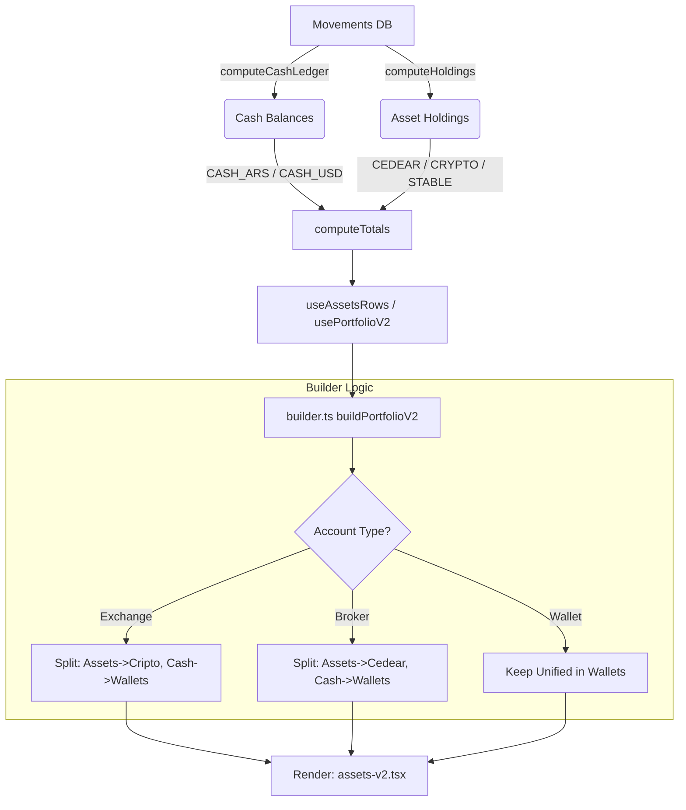

# Auditoría Mis Activos V2 — 2026-02-05

**Autor:** Antigravity (AI Agent)
**Fecha:** 2026-02-05
**Scope:** `src/pages/assets-v2.tsx`, `src/features/portfolioV2/builder.ts`, `src/hooks/use-computed-portfolio.ts`

## 1. Resumen Ejecutivo
Se realizó una auditoría técnica profunda sobre el módulo "Mis Activos V2" para diagnosticar inconsistencias en la clasificación de activos (Stablecoins vs Saldo USD), duplicación visual de cuentas en listas planas, inestabilidad en el toggle de vistas y falta de indicadores de rendimiento (chips TNA) en ciertas billeteras.

**Hallazgos principales:**
- **Saldo USD 200:** Proviene de ítems categorizados explícitamente como `CASH_USD` (dólar billete) ex el ledger, no de stablecoins.
- **Duplicados:** Son un efecto secundario intencional (pero ruidoso) del diseño "Split Liquidity", donde una cuenta (ej. Binance) se divide en dos proveedores lógicos (uno para Cripto, otro separado para su caja "Liquidez").
- **Toggle Quilombo:** La vista de "Cuentas" aplana estos proveedores divididos, mostrando la misma entidad dos veces con IDs distintos (`binance` y `binance-cash`), lo que desincroniza el estado de expansión y el ordenamiento.
- **Chips faltantes:** La lógica de UI existe, pero depende estrictamente de que la cuenta tenga metadata `cashYield` habilitada en el dominio, lo cual falta para Carrefour/Fiwind.

---

## 2. Reproducción
Pasos para evidenciar los problemas en el entorno local (`npm run dev`):

1. **Saldo USD en Billeteras:**
   - Navegar a `/mis-activos-v2`.
   - Expandir el rubro **Billeteras**.
   - Observar "Binance (Liquidez)" (u otro exchange) mostrando un ítem "Saldo USD" con valor, separado de la sección "Cripto".

2. **Duplicados en "Cuentas":**
   - Click en el toggle **"Cuentas"**.
   - Buscar "Binance" y "Binance (Liquidez)". Aparecen como dos tarjetas separadas.
   - Buscar "InvertirOnline" y "InvertirOnline (Liquidez)". Idem.

3. **Toggle Desordenado:**
   - Estando en "Cuentas", expandir "Binance".
   - Volver al toggle **"Rubros"**.
   - Expandir el rubro "Cripto". Notar que "Binance" (Activos) podría estar colapsado o viceversa, desorientando al usuario.

4. **Chips TNA/TEA:**
   - Buscar "Carrefour" o "Fiwind" en Billeteras.
   - Notar que no tienen el chip verde "TNA xx%".
   - Comparar con un Plazo Fijo que sí muestra los chips.

---

## 3. Mapa del Flujo de Datos



---

## 4. Hallazgos Detallados

### (A) Stablecoins / “Saldo USD 200” en Binance (Liquidez)
**Síntoma:** El usuario ve "Saldo USD" en Billeteras bajo Binance, esperando ver sus USDT allí o nada.
**Evidencia:**
- `src/features/portfolioV2/builder.ts:846`: El rubro `wallets` extrae explícitamente ítems con categoría `CASH_USD` de los exchanges:
  ```typescript
  if (isBroker(account) || isExchange(account)) {
      const cashMetrics = group.metrics.filter(m =>
          (m.category === 'CASH_ARS' || m.category === 'CASH_USD') ...
      )
      // Crea provider "${accountId}-cash"
  }
  ```
**Causa Raíz:**
El motor `computeCashLedger` está detectando movimientos con currency 'USD' que no están atados a un instrumento `STABLE` (USDT/USDC). Estos se acumulan como `CASH_USD` (fiat). Si el usuario importó USDT como "Dólar", el sistema lo trata como billete y el builder lo mueve a Billeteras. Las stablecoins reales (`category: STABLE`) se quedan correctamente en el rubro Cripto bajo la sección visual "Liquidez (Stable)".

**Impacto:**
Confusión conceptual. El usuario ve "USD" en su billetera y no sabe si es USDT o Fiat.

**Plan de Fix:**
1. **Validación de Datos:** Confirmar si el usuario tiene movimientos de `USD` fiat en Binance.
2. **UI Fix:** Renombrar "Saldo USD" a "Saldo Fiat USD" para desambiguar, o permitir consolidar `CASH_USD` de exchanges de vuelta al rubro Cripto si se prefiere (cambio de regla en builder).

---

### (B) Duplicación de Cuentas
**Síntoma:** Binance e IOL aparecen dos veces en la vista "Cuentas".
**Evidencia:**
- `builder.ts`: Crea dos objetos `ProviderV2` distintos para la misma `accountId`:
  1. `id: accountId` (con activos no-cash en rubro Cripto/Cedear).
  2. `id: acountId-cash` (con activos cash en rubro Billeteras).
- `assets-v2.tsx:273`: Flatten de rubros para la vista "Cuentas":
  ```typescript
  const allProviders = portfolio.rubros.flatMap(r => r.providers)
  ```
**Causa Raíz:**
El diseño "Split Liquidity" crea entidades separadas en el modelo de vista (`PortfolioV2`). La vista "Cuentas" es una simple lista plana de estos proveedores, revelando la separación interna.

**Impacto:**
Ruido visual y sensación de "bug".

**Plan de Fix:**
1. **Unificación en Vista Cuentas:** En `assets-v2.tsx`, al computar `allProviders`, realizar un paso de agrupación:
   - Agrupar providers por `baseAccountId` (removiendo el sufijo `-cash`).
   - Fusionar `items` y `totals` en un solo `ProviderV2` compuesto para la visualización.

---

### (C) Toggle Rubros/Cuentas "Quilombo"
**Síntoma:** Al volver a rubros, el estado de expansión o el orden parece incorrecto.
**Evidencia:**
- Los IDs de los providers split (`binance` vs `binance-cash`) son distintos.
- Si el usuario expande "Binance" en la vista Cuentas (que podría ser el provider de Activos o el de Cash), solo se agrega ESE id al `expandedProviders`.
- Al volver a Rubros, si expandió el de Cash, verá expandido el provider en Billeteras, pero COLAPSADO el provider en Cripto. Esta asimetría se percibe como "desorden".
- El sort (`b.totals.ars - a.totals.ars`) en Cuentas reordena agresivamente.

**Causa Raíz:**
Desconexión de estado (`expandedProviders`) entre las dos representaciones de la misma cuenta física.

**Plan de Fix:**
1. Sincronizar expansión: Al hacer toggle de un provider, expandir/colapsar TODOS los providers que compartan el mismo `baseAccountId`.
   ```typescript
   const toggleProvider = (id: string) => {
       const baseId = id.replace(/-cash$/, '')
       const targetIds = [baseId, `${baseId}-cash`]
       // Update set for all targets
   }
   ```

---

### (D) Chips TNA/TEA Faltantes
**Síntoma:** Billeteras remuneradas (Carrefour, Fiwind) no muestran chip.
**Evidencia:**
- `builder.ts:207`: `buildYieldMeta` requiere:
  ```typescript
  if (!account?.cashYield?.enabled) return undefined
  ```
**Causa Raíz:**
Las cuentas `Carrefour` y `Fiwind` en la base de datos (o mock) no tienen `cashYield: { enabled: true, tna: ... }` configurado. La UI de `assets-v2.tsx` (`ItemRow`) ya soporta mostrar los chips si `yieldMeta` existe.

**Plan de Fix:**
1. **Data Entry:** Asegurar que las cuentas tengan la metadata correcta.
2. **Fallback UI:** Permitir editar TNA manualmente desde la UI para cuentas tipo Wallet (ya existe `useProviderSettings` parcialmente, extender para `tnaOverride`).

---

## 5. Lista de Archivos Relevantes para Implementación

- `src/features/portfolioV2/builder.ts`: Lógica de split y asignación de `yieldMeta`.
- `src/pages/assets-v2.tsx`: Lógica de `allProviders` (merge) y handlers de toggle (sync).
- `src/domain/portfolio/types.ts`: Metadata de cuentas.

## 6. Riesgos / Regresiones
- **Unificación de Cuentas:** Al fusionar providers en la vista "Cuentas", hay que tener cuidado de no duplicar totales (sumar totales ya calculados vs recalcular desde items).
- **Sync de Expansión:** Podría ser confuso si el usuario quiere expandir solo la liquidez y se le abre también la cartera de inversiones. (Se asume que prefiere ver la cuenta completa).

---
**Próximo paso:** Implementar el "Fix Plan" priorizando la unificación visual en Cuentas y la sincronización del toggle.
